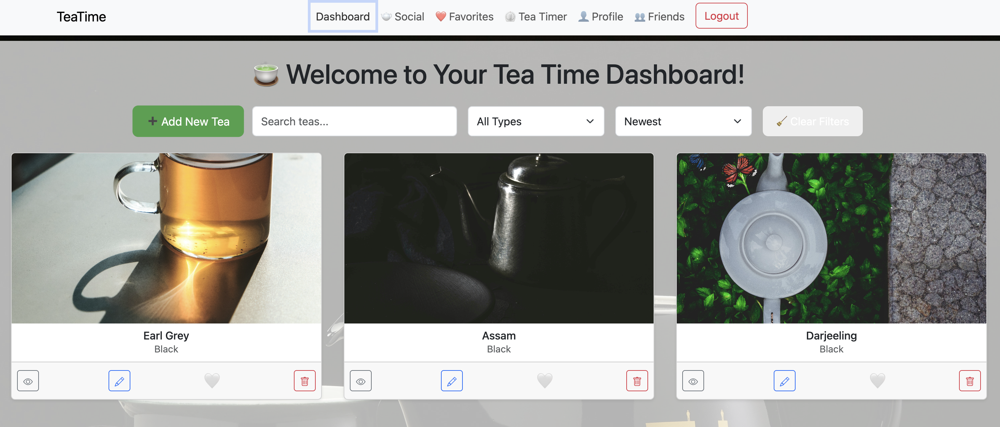

# TeaTime

## Table of Contents

- [Group Members](#group-members)
- [Sites](#sites)
- [Description](#description)
- [Installation](#installation)
- [Environment Variables](#environmental-variables)
- [Technologies Used](#technologies-used)
- [Features](#features)
- [Screenshots](#screenshots)
- [Future Work](#future-work)
- [Resources](#resources)
- [License](#license)

## Sites

- [GitHub Repository](https://github.com/chicalauren/TeaTime)
- [Live Website](https://teatime-wcue.onrender.com/login)

## Group Members

- Eldrish https://github.com/Eldrish-Ramos
- Lauren https://github.com/chicalauren
- Liz https://github.com/Liz-Melcher
- Tiffany https://github.com/TiffanyMClark

## Description

Tea Time is a web app built in React for tea lovers who want a smarter way to keep track of their collection. The goal is simple: help users log, rate, and rediscover their favorite teas, all while socializing with fellow tea lovers! Whether you’re into fine oolongs or herbal blends, Tea Time makes it easy to store tasting notes, brew settings, ratings, and more—so no great cup is ever forgotten

## Installation

To install and run on a local machine:

```
npm i
npm run build
npm run seed
npm run dev
```

## Environmental Variables

Add a server .env file with the following:

```
MONGODB_URI=your-mongodb-connection-string
JWT_SECRET=your-secret-key
CLOUDINARY_UPLOAD_URL=your-api-key
```

Add a client .env file with the following:

```
VITE_CLOUDINARY_UPLOAD_URL=your api-key
```


- Test User for logging into the DB unless you make your own!

  username: "test",

  email: "test@example.com",

  password: "password123",

Cloudinary API is only needed if the site will be deployed to a web server; it is not necessary if images will be hosted locally.

## Technologies Used

- React (TypeScript)
- GraphQL + Apollo Server/Client
- Node.js + Express
- MongoDB + Mongoose
- JWT Authentication
- Bootstrap (React-Bootstrap)
- Vite (Frontend bundler)
- Render (Hosting)

## Features

- User authentication (register/login)
- Add, edit, and delete teas from your collection
- Upload photos and write tasting notes
- Mark teas as favorites
- Search teas by tags or type
- Connect with other users by sending friend requests

## Screen Shots

### Dashboard view



## Future Work

- Favorite posts
- Add profile image to the comments and the post on the social page
- Being able to add hyperlinks in the comments

## Resources

- [Cloudinary](https://cloudinary.com/) for hosting images that users upload for teas and for profile pictures
- [UnSplash](https://unsplash.com/) for stock images of teas; all images used are under a free license

## License

MIT License
